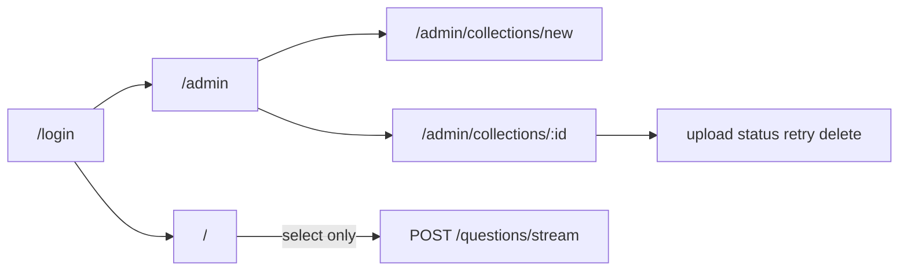

# PRD: Admin Collections & Documents (DiLLeMa)

| Field | Value |
| --- | --- |
| Product | DiLLeMa dashboard (vendored at `apps/RAGforge`) |
| Version | 1.0 |
| Status | Draft for implementation |
| Audience | Backend, frontend, and anyone operating the local RAG stack |
| Scope | v1: JWT + roles (`admin` / `user`), admin pages for collections and documents |
| Out of this document | Implementing the feature itself; this file is the specification |

---

## 1. Summary

The dashboard already stores collections and files, indexes them into Qdrant, and answers questions through DiLLeMa LLM. The **chat UI works**. The **admin UI does not**: create/upload/delete screens were built, then disconnected from the chat sidebar.

v1 adds:

1. Login with JWT and two roles in Postgres.
2. A separate Admin area for collections and documents.
3. Backend fixes without which Admin would lie (list filters, PATCH, retry, delete that actually removes vectors and disk files).

Chat stays a **select-and-ask** surface. Knowledge is filled only in Admin.

---

## 2. Product context (as the code works today)

### 2.1 Stack

```
Browser (Vite, port 3000)
  → Dashboard FastAPI (/api/v1)     ← this PRD’s API
       → Postgres (collections, files, questions)
       → Qdrant (vectors)
       → DiLLeMa OpenAI-compatible LLM (LLM_BASE_URL, typically :8000/v1)
```

Do not confuse ports:

- **Dashboard API** is the backend this frontend calls (`VITE_BACKEND_URL` / `BACKEND_URL`). In the current local setup that is often `http://localhost:8080` because DiLLeMa already occupies `:8000`.
- **DiLLeMa** is the LLM at `LLM_BASE_URL` (e.g. `http://127.0.0.1:8000/v1`). Admin never talks to DiLLeMa directly.
- **Vite proxy** in `web/vite.config.ts` maps `/api` → the dashboard API. Components today call an absolute `BACKEND_URL`, so the proxy is unused unless that env is relative.

### 2.2 Live chat path

`web/src/App.tsx` is an in-memory view switch (`welcome` | `chat` | `collections`), **not** React Router (the dependency is installed but unused).

Live path:

1. Welcome → “Create New Chat”
2. `ChatDashboard` + `CollectionSelector` loads `GET /api/v1/collection`
3. User selects a collection
4. `ChatInput` posts `POST /api/v1/questions/stream` (`application/x-www-form-urlencoded`, `using_augment_query=true` always)
5. UI buffers the SSE body, then paints one assistant HTML message

There is **no login**.

### 2.3 Management UI that exists but is unreachable

| Component | What it does | Why users never see it |
| --- | --- | --- |
| `AddCollectionModal.tsx` | POST collection (name + description; vectordb name auto `spaces → _`) | Open button in `CollectionSelector` is commented out |
| `ManageCollectionModal.tsx` | List/upload files, delete collection | Same; ⋯ menu commented out |
| `CollectionManager.tsx` | Full-page list/create/delete; **manual** vectordb name field | `App.tsx` `collections` view is never set (`onManageCollections` unused) |
| `DeleteCollectionModal.tsx` | Confirm copy | Only used by the two screens above |

**Do not re-enable those sidebar buttons in v1.** Admin is a separate IA. Dual create UIs (auto vs manual vectordb name) must not both stay as product surface; v1 uses one server-generated slug.

### 2.4 Live API (unauthenticated)

Mounted at `/api` + `/v1` → `/api/v1/...` (`app/main.py`, `app/api/v1/routes.py`).

**Collections** (`app/api/v1/endpoints/collections.py`):

- `GET /api/v1/collection` — query via `FindCollection`
- `POST /api/v1/collection` — multipart/form `CreateCollectionRequest`
- `GET /api/v1/collection/{collection_name}` — **Qdrant scroll of documents**, not Postgres metadata
- `DELETE /api/v1/collection/{collection_name}` — by display name

**Files** (`app/api/v1/endpoints/files.py`):

- `GET /api/v1/files` — raw `{ metadata, data }`, **not** `PaginatedResponse`
- `POST /api/v1/files` — `collection_id` + `file`; background `PipelineService`
- `GET /api/v1/files/{file_id}`
- `DELETE /api/v1/files/{file_id}` — **Postgres row only** (no Qdrant, no disk)

**Questions** (`app/api/v1/endpoints/questions.py`):

- `POST /api/v1/questions`
- `POST /api/v1/questions/stream`
- `DELETE /api/v1/questions/clear-all`

No user model, no JWT, no admin routes. `SECRET_KEY` in `app/core/config.py` is unused. `AuthError` exists and is unused. `app.core.dependencies` is wired in the DI container but the module does not exist.

### 2.5 Data model (relevant fields)

**`collections`** (`app/models/collections.py`): `id`, timestamps, `collection_name` (unique), `description`, `vectordb_collection_name` (unique, Qdrant collection id). `normalize()` lowercases names but is never called.

**`files`** (`app/models/files.py`): `file_name`, `file_path`, `file_type`, `file_size`, `metadatas` JSON, `status` enum `pending | processing | completed | failed | deleted | archived` (default `pending`), `processing_started_at`, `processing_ended_at`, `collection_id` FK CASCADE.

Indexing IDs in Qdrant: `{file_id}_{chunk_index}` hashed to int. Payload includes `file_name` / text.

### 2.6 Known bugs that Admin must not inherit

1. **`FindCollection` requires `collection_name` and `vectordb_collection_name`** (`app/schema/collection_schema.py`). A true “list all” is awkward; the frontend already sends empty query params.
2. **Delete file** does not remove Qdrant points or the file under `app/files/` (`config.FILE_PATH`).
3. **Delete collection** deletes Postgres first, then Qdrant (`collection_service.py`). Disk files are not removed. If Qdrant delete fails, vectors remain.
4. **No PATCH collection, no retry/reindex endpoint.**
5. **`GET /collection/{name}` returns Qdrant docs**, colliding with the need for an admin detail payload.
6. **`GET /files` envelope is inconsistent** with other routes.
7. **`processing_*_at` typed `str` on the model, `DateTime` in migrations** — Admin “Indexed at” needs this fixed.
8. **`DocumentCleaner` is constructed and never used** in `pipeline_service.py`. Indexing still runs; v1 does not require turning it on.
9. **Embedding is hardcoded `sentence-transformers/all-mpnet-base-v2` (768 dim)** in pipeline, question service, and Qdrant `create_collection`. `.env.example` says `intfloat/multilingual-e5-small`. **Do not switch embedding in v1** without a Qdrant migration.
10. Chat vs API collection shapes: UI `{ id, name, description }` vs API `collection_name`.

---

## 3. Problem

Operators have no official place to add a knowledge base. Chat can only select collections that already exist. Management code is dead. The API has no identity. Deleting a file in any UI built on today’s DELETE would leave searchable chunks in Qdrant.

## 4. Goals (v1)

- Admin area, separate from chat, protected by JWT and role `admin`.
- Admin can: create / update / delete collections; upload / list / see index status / delete documents; retry `failed` documents.
- Role `user` can only chat (pick a collection and ask). No knowledge management.
- UI stays utilitarian: existing navy tokens, no AI-dashboard chrome (no gradients, glow, purple, glass, extra display fonts, or marketing empty states).

## 5. Non-goals (v1)

- Settings page for `LLM_BASE_URL`, DiLLeMa `--model-id`, or embedding model
- Question-history admin or UI for `DELETE /questions/clear-all`
- Refresh tokens, OAuth, password reset, invite flow, multi-tenant orgs
- In-place document editing (replace = delete + upload, or retry)
- Token-by-token streaming in chat
- Re-enabling manage/add controls in the chat sidebar
- Bulk “reindex entire collection”
- Changing the embedding model or Qdrant vector size

## 6. Personas and permissions

### 6.1 Personas

- **Admin** — fills the knowledge base. Signs in at `/login`, lands on `/admin`. May also open chat.
- **User** — chat only at `/`. No Admin nav. Collection/file mutations return 403.

### 6.2 Permission matrix

| Action | Public | `user` | `admin` |
| --- | --- | --- | --- |
| `POST /api/v1/auth/login` | yes | yes | yes |
| `GET /api/v1/auth/me` | no | yes | yes |
| `GET /api/v1/collection` | no | yes | yes |
| `GET /api/v1/collection/{id}` (new metadata) | no | yes | yes |
| `POST / PATCH / DELETE` collection | no | 403 | yes |
| `GET /api/v1/files` | no | yes (own use: chat may not need it) | yes |
| `POST / DELETE` files, `POST .../retry` | no | 403 | yes |
| `POST /api/v1/questions` and `/questions/stream` | no | yes | yes |
| `DELETE /api/v1/questions/clear-all` | no | 403 | yes (no UI in v1) |
| Legacy `GET /api/v1/collection/{name}` Qdrant dump | no | 403 | optional; prefer not to use in UI |

**Chat requires login.** If chat stays public, JWT on Admin is theater: anyone can still hit the API.

Unauthenticated mutating or protected reads: **401**. Wrong role: **403**.

---

## 7. Authentication

### 7.1 Table `users` (new Alembic revision)

| Column | Type | Notes |
| --- | --- | --- |
| `id` | UUID PK | same pattern as `BaseModel` |
| `email` | string, unique, not null | login identifier, store lowercase |
| `password_hash` | string, not null | never return in API |
| `role` | enum `admin` \| `user` | not null |
| `created_at`, `updated_at` | timestamptz/datetime | same as existing models |

No other profile fields in v1.

### 7.2 Seed

On application startup, if `users` is empty, create one admin from environment:

- `ADMIN_EMAIL`
- `ADMIN_PASSWORD`

Document both in `.env.example`. **Do not hardcode a password in the repo.** If env is missing and the table is empty, log a clear error and skip seed (login will fail until configured).

Creating additional `user` rows in v1 may be a one-off script or a follow-up; this PRD does not require a “create user” Admin screen.

### 7.3 Endpoints

**`POST /api/v1/auth/login`** (public, JSON)

Request:

```json
{ "email": "admin@example.com", "password": "…" }
```

Success `200`:

```json
{
  "access_token": "<jwt>",
  "token_type": "bearer",
  "expires_in": 28800,
  "user": {
    "id": "<uuid>",
    "email": "admin@example.com",
    "role": "admin"
  }
}
```

Failure `401`: `{ "detail": "Email or password is wrong." }` — never say which field failed.

**`GET /api/v1/auth/me`** (Bearer required)

Success `200`: `{ "id", "email", "role" }`.

### 7.4 JWT

- Algorithm: HS256
- Secret: existing `SECRET_KEY` in `app/core/config.py` (must be set stably in `.env` for tokens to survive restart)
- Claims: `sub` (user id string), `role`, `exp`
- TTL: **8 hours** (`expires_in`: 28800)
- No refresh token. Expiry → login again

Password hashing: passlib with bcrypt (or argon2). Verify only through that library.

### 7.5 Frontend session

- Store `access_token` (and optionally `user`) in **`sessionStorage`**, not `localStorage`
- Every API call: `Authorization: Bearer <token>`
- `401`: clear storage, redirect `/login`
- No cookie auth in v1, so no CSRF cookie flow; CORS can stay origin-list based (`BACKEND_CORS_ORIGINS`, include `http://localhost:3000`)

---

## 8. Information architecture



Use **React Router** as the source of truth. Remove `currentView: welcome | chat | collections` as the routing mechanism.

| Path | Who | Screen |
| --- | --- | --- |
| `/login` | public | Email + password |
| `/` | `user`, `admin` | Chat (optional short welcome once per session is allowed; not a second product) |
| `/admin` | `admin` | Collection list |
| `/admin/collections/new` | `admin` | Create form |
| `/admin/collections/:id` | `admin` | Metadata + documents |

Unknown path: redirect `/` if logged in, else `/login`.

`user` visiting `/admin` or `/admin/*`: full-page message “You don’t have access to this page.” + link to `/`. Do not flash Admin chrome.

`admin` header may include a text link “Chat” to `/`. Chat header for admin may include “Admin” to `/admin`. Users must not see “Admin”.

---

## 9. UI specification

### 9.1 Visual principles (not “AI”)

Reuse tokens in `web/src/index.css`:

- Light: background `0 0% 90%`, foreground `215 45% 25%`, primary `215 100% 27%`
- Dark: existing `.dark` class (theme toggle already in chat)

Rules:

- System / UI font only. No new Google display font.
- No gradients, mesh backgrounds, glow, neon, purple-indigo palettes, glassmorphism, or large decorative illustrations.
- Flat page chrome: 56px header, 1px border, content padding 24px.
- One primary button per page (navy). Destructive actions: outline or red `bg-red-500` already used by `Button` variant `destructive`.
- Add missing CSS tokens `destructive` / `destructive-foreground` so modal/page delete styles are defined (they are referenced today but missing from the theme).
- Empty copy is factual: “No collections yet.” + button “New collection”. Forbidden: “Your AI knowledge hub is empty”, sparkles, robot empty states.
- Errors: a bordered banner above the table/form, not `console.error` only.
- Confirmations: existing overlay pattern `fixed inset-0 bg-black/50`, short copy, no icons-as-decoration.

Admin product name in chrome: **DiLLeMa** (match the logo files).

### 9.2 Shared Admin shell

- **Header (56px):** wordmark DiLLeMa (text + existing logo if it loads), spacer, email, **Logout**
- **Left nav (~220px):** single item **Collections** (active state: navy text or left border). No Settings in v1.
- **Main:** page title on the left, primary action on the right, optional filter, table, pagination if `total_count > page_size`

Reuse `web/src/components/ui/Button.tsx` and `Input.tsx`. Prefer **pages over stacked modals** for create and detail. Delete stays a small confirm dialog.

### 9.3 Login (`/login`)

Centered card, max width ~360px, on `bg-background`. No hero art.

| Control | Rules |
| --- | --- |
| Email | required, type email |
| Password | required, type password |
| Submit | “Sign in”, disabled while loading |

- Wrong credentials: banner “Email or password is wrong.”
- Success: `admin` → `/admin`; `user` → `/`
- Already logged in: redirect by role

### 9.4 Collection list (`/admin`)

Title: **Collections**. Primary: **New collection**.

Optional client-side name filter (no extra API in v1).

| Column | Source |
| --- | --- |
| Name | `collection_name` |
| Description | truncated, em dash if empty |
| Documents | `file_count` |
| Created | `created_at` local date |
| Actions | **Open** (navigate to detail), **Delete** (confirm) |

Empty: “No collections yet.” + **New collection**.

Loading: “Loading…” or disabled table, not skeleton shimmer libraries.

### 9.5 Create collection (`/admin/collections/new`)

Title: **New collection**. Cancel → `/admin`.

| Field | Required | Maps to |
| --- | --- | --- |
| Name | yes | `collection_name` |
| Description | no | `description` |

**No “Vector DB name” field.** Server generates `vectordb_collection_name`.

Validation:

- Empty name: client + `422`
- Duplicate `collection_name`: `409` “A collection with this name already exists.”

On success: go to `/admin/collections/{id}`.

### 9.6 Collection detail (`/admin/collections/:id`)

**Section A — Metadata**

- Name (editable)
- Description (textarea, editable)
- Storage id: `vectordb_collection_name`, **read-only** (do not offer rename in v1)
- **Save** → `PATCH`

**Section B — Documents**

Primary: **Upload**. Drop zone: “Drop PDF, Word, Markdown, or text files here.” `accept=".pdf,.txt,.docx,.md"` (same as `ManageCollectionModal.tsx`). Multiple files allowed.

| Column | Source |
| --- | --- |
| Name | `file_name` |
| Type | short MIME or extension |
| Size | human bytes |
| Status | badge (below) |
| Indexed at | `processing_ended_at` if `completed`, else — |
| Actions | **Retry** if `failed`; **Delete** always |

After upload, row appears as `pending`. **Poll `GET /files?collection_id=` every 2 seconds** while any row is `pending` or `processing`. Stop when all are `completed` or `failed`. No websocket in v1.

Empty documents: “No documents in this collection.” + Upload.

### 9.7 Status badges

Solid background, no glow.

| `status` | Label | Color |
| --- | --- | --- |
| `pending` | Queued | gray |
| `processing` | Indexing | navy (primary) |
| `completed` | Ready | dark green |
| `failed` | Failed | red + Retry |

Do not surface `deleted` / `archived` in the table (filter them out if they appear).

### 9.8 Delete copy

**Collection:**

> Delete collection {name}? Documents and indexed text will be removed. This cannot be undone.

Buttons: Cancel, Delete.

**File:**

> Delete {file_name}? It will be removed from search.

### 9.9 Chat (only what v1 changes)

- Require Bearer; unauthenticated users are sent to `/login`.
- Sidebar remains **select only**. Do not uncomment Add / Manage / “Manage Collections”.
- Keep `using_augment_query=true` as today (out of scope to expose a toggle).
- Keep existing welcome overlay “Please select a collection to begin”.
- Mapping: API `collection_name` → UI `name`, plus `id`.

---

## 10. API specification (v1 deltas)

Unless noted, JSON request/response, `Authorization: Bearer` required.

Envelope for single resources stays `BaseResponse` (`data`, `status`, `message`). Lists stay `PaginatedResponse` (`data`, `metadata: { total_count, page, page_size }`).

### 10.1 Auth

See §7.3.

### 10.2 Collections

**`GET /api/v1/collection`**

Query **optional**: `page`, `page_size`, `ordering`, `collection_name` (search/contains or exact — pick one and document it; recommended: case-insensitive contains), `description`.

**Fix `FindCollection`:** `collection_name` and `vectordb_collection_name` must not be required for listing.

Each item:

- `id`, `collection_name`, `description`, `vectordb_collection_name`, `file_count`, `created_at`, `updated_at`

**`POST /api/v1/collection`** (admin)

JSON preferred (form still acceptable for compatibility):

```json
{ "collection_name": "Computer Networks", "description": "Module 1" }
```

Server sets `vectordb_collection_name`: lowercase, whitespace and `/` → `_`, strip unsafe chars, ensure uniqueness with a short suffix if needed. Then create Qdrant collection (vector size **768**, unchanged). On Qdrant failure: delete Postgres row (keep today’s rollback).

**`PATCH /api/v1/collection/{id}`** (admin)

```json
{ "collection_name": "…", "description": "…" }
```

Both optional. **Never change `vectordb_collection_name` in v1.**

**`GET /api/v1/collection/{id}`** (authenticated)

Postgres metadata + `file_count` + counts by status (`pending`, `processing`, `completed`, `failed`). **Not** a Qdrant scroll.

Keep legacy `GET /api/v1/collection/{collection_name}` only if needed for old clients; Admin UI must use **id**. If both stay, disambiguate (UUID path vs name) so a UUID is not parsed as a name.

**`DELETE /api/v1/collection/{id}`** (admin)

Order:

1. Delete Qdrant collection `vectordb_collection_name`
2. Unlink all disk files for that collection’s `files.file_path`
3. Delete Postgres collection (CASCADE files and questions)

Path by name may remain as a deprecated alias.

### 10.3 Files

**`GET /api/v1/files`**

Must return `PaginatedResponse`. Filter `collection_id`. Include `id`, `file_name`, `file_path` (or omit path from client if unused), `file_type`, `file_size`, `status`, `processing_started_at`, `processing_ended_at`, `collection_id`.

**`POST /api/v1/files`** (admin, multipart)

- `collection_id` (UUID form field)
- `file` (upload)

Allowlist (match UI): extensions `.pdf`, `.txt`, `.docx`, `.md` and corresponding MIME types. Reject others with `422`. Write to `FILE_PATH`, insert row `pending`, schedule pipeline. Response is the file row immediately (status still `pending`).

**`POST /api/v1/files/{file_id}/retry`** (admin)

Allowed when `status` is `failed`, or `pending`/`processing` stuck beyond a documented timeout (implementation may start with `failed` only). Set `pending`, clear error metadata if any, **delete existing Qdrant points for this file**, run pipeline again. `409` if status is `completed` and retry is not allowed (v1: do not retry completed).

**`DELETE /api/v1/files/{file_id}`** (admin)

1. Delete Qdrant points belonging to this file (payload/id prefix `{file_id}_` or equivalent filter)
2. Unlink `file_path` on disk if present
3. Delete Postgres row

`GET /api/v1/files/{file_id}` remains for polling a single row if useful.

### 10.4 Error codes (product-facing)

| HTTP | When |
| --- | --- |
| 401 | Missing/invalid/expired token |
| 403 | Authenticated but role cannot perform the action |
| 404 | Unknown collection or file id |
| 409 | Duplicate collection name; retry on illegal status |
| 422 | Validation (empty name, bad file type) |

Frontend maps these to the banner. Network failure: “Could not reach the server.”

---

## 11. Indexing contract (status UI)

`PipelineService.run_pipeline` already:

1. Sets `processing` + `processing_started_at`
2. Reads PDF / DOCX (pypandoc) / `text/*`
3. Chunks (`DocumentChunker`)
4. Upserts Qdrant
5. Sets `completed` + `processing_ended_at` + metadatas, or `failed` on exception

Admin depends on this state machine. v1 work that **is** required:

- Persist real datetimes for `processing_*_at` so “Indexed at” works
- Retry deletes old points before re-upsert (no duplicate chunks in search)
- File-type allowlist aligned with the UI

v1 work that is **not** required (disclose only):

- Calling `DocumentCleaner`
- Switching to `EMBED_MODEL_NAME=intfloat/multilingual-e5-small`

---

## 12. Edge cases

- Collection with zero files: selectable in chat; backend may return “Tidak ada jawaban yang ditemukan.” Admin shows empty documents.
- Concurrent uploads: allowed; each file has its own pipeline.
- Qdrant down on create collection: no orphan Postgres row (existing rollback).
- JWT expires mid-upload: 401 → login; file may still finish indexing in the background — list after re-login must show it.
- Odd collection names: slug sanitised; collisions get a short suffix.
- Delete collection while a file is `processing`: still delete; pipeline error on missing row must be logged, not crash the API.
- Chat list must not show collections the user cannot query; v1 has no per-collection ACL, so all authenticated users see all collections.

---

## 13. Success criteria (acceptance)

1. Admin signs in, creates a collection, uploads a PDF, status becomes Ready, collection appears in the chat sidebar, a question returns a model answer (DiLLeMa reachable).
2. User signs in, cannot open `/admin`, `POST /api/v1/collection` returns 403.
3. After delete file, that document’s content is no longer retrieved in chat.
4. After delete collection, it disappears from chat list and Qdrant has no collection of that storage id.
5. Retry on Failed moves through Indexing to Ready or Failed again, with the banner if it fails.
6. Requests without a token to protected routes return 401.
7. Admin UI uses the dashboard API base URL, never DiLLeMa `/v1`, for collection/file calls.

---

## 14. Implementation notes (for the team, not extra scope)

- Dead `app/controllers/*` (`src.*` imports) stay out of this work.
- `zustand` and unused Streamlit `web/main.py` are out of scope.
- Chat still buffers SSE; do not treat that as an Admin defect.
- Local ports: document in README that frontend `VITE_BACKEND_URL` must point at the **dashboard API**, while `.env` `LLM_BASE_URL` points at **DiLLeMa**.

---

## 15. Risks (must not be missed)

1. **Port mix-up** — wiring Admin to `:8000` while DiLLeMa owns that port will either 404 or hit the LLM by mistake.
2. **Dual store** — every delete and retry must touch Qdrant and Postgres (and disk for files).
3. **Legacy GET by name** — returning 10k Qdrant points is not an Admin detail page; new GET-by-id is mandatory.
4. **CORS** — Bearer headers from `http://localhost:3000` must remain allowed; no cookies in v1.
5. **Embedding lock-in** — Qdrant size 768 and `all-mpnet-base-v2` stay until a dedicated migration PRD.
6. **Unreachable old modals** — leaving them in the repo is fine; shipping two create forms (manual vs auto slug) is not.

---

## 16. Glossary

| Term | Meaning |
| --- | --- |
| Collection | Postgres row the user sees as a knowledge source in chat |
| Storage id | `vectordb_collection_name`, Qdrant collection name, server-generated |
| Document / file | Uploaded PDF/DOCX/MD/TXT indexed into that collection |
| DiLLeMa | Separate serving process; OpenAI-compatible `/v1` |
| Dashboard API | FastAPI app this Admin talks to |
