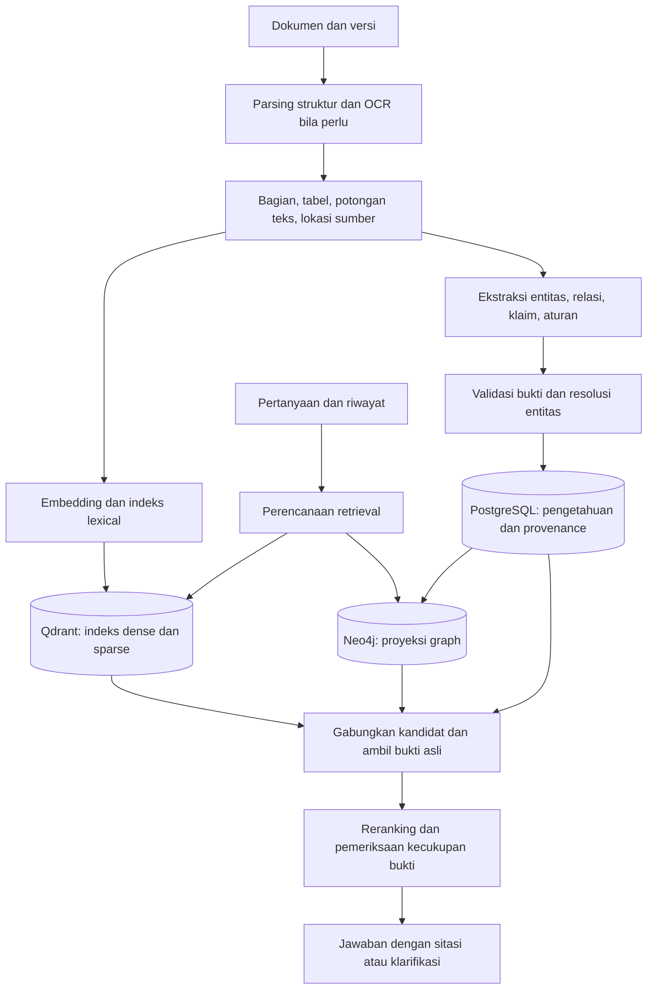

# Rancangan DiLLeMa v2: Knowledge Extraction dan Knowledge Graph

Status: arsitektur target, 17 September 2026. Pilot awal sudah diimplementasikan; status aktual dan pekerjaan tersisa tercatat di [rencana implementasi](DILLEMA_V2_PLAN.md), dengan [panduan menjalankan](DILLEMA_V2_RUNBOOK.md). Dokumen desain ini tidak menyatakan seluruh fitur telah tersedia atau telah dibenchmark. Pilihan teknologi dan parameter perlu diuji pada dokumen pengguna.

Asumsi awal: v2 menyediakan skema pengetahuan yang dapat dikonfigurasi per collection. Contoh akademik digunakan karena muncul pada data evaluasi repo; contoh tersebut tidak membatasi platform pada satu domain.

## 1. Tujuan dan batas versi pertama

DiLLeMa v2 menggabungkan ekstraksi pengetahuan terstruktur, pencarian teks, dan pencarian relasi agar jawaban lintas dokumen memiliki bukti yang dapat diperiksa. Ukuran keberhasilannya adalah kualitas jawaban dan ekstraksi, bukan jumlah node graph.

MVP mencakup satu collection pilot, dokumen PDF/DOCX/Markdown/teks, ekstraksi entitas dan klaim bersumber, pencarian graph lokal, pencarian hybrid, sitasi, serta pemeriksaan hasil ekstraksi. Tabel dan PDF hasil pindai masuk pengujian parsing sejak awal. Ringkasan seluruh corpus, penalaran aturan otomatis, dan interpretasi diagram/gambar kompleks menjadi pengembangan berikutnya.

Knowledge Graph berfungsi menghubungkan informasi dan menemukan bukti. Jalur antar-node tidak dengan sendirinya membuktikan bahwa sebuah kesimpulan benar. Persyaratan, pengecualian, negasi, dan masa berlaku harus diperiksa terhadap sumber sebelum digunakan dalam jawaban.

## 2. Titik awal pada repo

| Area | Kondisi yang ditemukan | Perubahan v2 |
| --- | --- | --- |
| Serving | `dillema/serve/llm.py` menjalankan LLM lewat Ray Serve/vLLM. | Sediakan konfigurasi terpisah untuk model ekstraksi dan model jawaban; keduanya boleh memakai deployment yang sama pada pilot. |
| Ingestion | `apps/app/pipeline/pipeline_service.py` membaca teks lalu langsung memotong dan mengindeksnya. PDF kehilangan identitas halaman dalam representasi yang diteruskan. | Tambahkan representasi dokumen terstruktur, versi, bukti, dan tahap ekstraksi yang dapat diulang. |
| Pekerjaan latar | Endpoint upload menggunakan FastAPI `BackgroundTasks`. | Jadikan status pekerjaan persisten dengan retry, checkpoint, lease, dan worker terpisah dari request API. |
| Retrieval | `question_service.py` mencari vektor, mengambil teks payload, lalu rerank jika augmentasi aktif. | Pertahankan ID, skor, metadata, dan sumber; gabungkan pencarian dense, lexical, dan graph. |
| Graph | Belum ada penyimpanan graph atau skema entitas/relasi pada jalur aplikasi. | Tambahkan model pengetahuan kanonis dan proyeksi graph. |
| Riwayat | Backend tidak menerima riwayat percakapan; jawaban streaming disimpan sebagai string kosong. | Simpan jawaban lengkap, tambahkan conversation ID, dan gunakan riwayat untuk menyelesaikan rujukan pertanyaan. |
| Evaluasi | Notebook menggunakan dokumen hasil retrieval pertama sebagai `answer`. | Evaluasi jawaban aktual dan ekstraksi terhadap anotasi manusia. |

## 3. Arsitektur yang diusulkan



Pembagian peran yang diusulkan:

- **PostgreSQL**: sumber kanonis untuk dokumen, versi, potongan teks, bukti, entitas, klaim, hasil review, pekerjaan, dan manifest publikasi indeks.
- **Qdrant**: proyeksi pencarian dense dan sparse yang menunjuk ke ID potongan teks kanonis.
- **Neo4j**: proyeksi relasi untuk traversal dan eksplorasi pengetahuan.
- **Penyimpanan file**: dokumen asli serta hasil parsing yang dapat dilacak versinya; pilot dapat memakai penyimpanan lokal yang sudah ada.
- **Ray/vLLM**: komputasi inference. Worker ingestion mengatur pekerjaan dan batas konkurensi agar ekstraksi tidak menghabiskan kapasitas chat.

Neo4j adalah usulan untuk traversal dan eksplorasi graph, bukan prasyarat konseptual Knowledge Graph. Pilot yang sangat kecil dapat memakai tabel entitas/relasi PostgreSQL, lalu menambahkan proyeksi Neo4j ketika kebutuhan traversal terukur. Untuk rancangan target, Neo4j dipisahkan melalui adapter agar model pengetahuan tidak tergantung satu database.

Pola local GraphRAG menggabungkan data graph dengan potongan dokumen asli. Global search berbasis community reports ditujukan untuk pertanyaan atas keseluruhan corpus dan memerlukan sumber daya lebih banyak. Local retrieval menjadi tahap pertama v2. [Dokumentasi query Microsoft GraphRAG](https://microsoft.github.io/graphrag/query/overview/).

## 4. Advanced Knowledge Extraction

### 4.1 Pemahaman struktur dokumen

Representasi hasil parsing memuat halaman, heading, paragraf, daftar, tabel, caption, dan urutan baca. Potongan teks mempertahankan konteks judul dan identitas blok asal. Tabel mempertahankan header, hubungan baris/kolom, satuan, dan catatan kaki. OCR digunakan saat dokumen membutuhkan pembacaan citra.

Docling menjadi kandidat parser untuk diuji karena mendukung pemahaman layout, struktur tabel, dan OCR. Ukur hasilnya pada dokumen Indonesia aktual, termasuk PDF multikolom dan hasil pindai. [Dokumentasi Docling](https://docling-project.github.io/docling/).

Simpan lokasi sumber sesuai format: nomor halaman dan bounding box untuk PDF, atau jalur heading/paragraf untuk DOCX/Markdown. Lokasi karakter merujuk ke teks kanonis hasil parsing, dengan pemetaan ke blok asli. Kutipan hasil OCR tetap dapat dibuka pada citra halaman untuk pemeriksaan.

### 4.2 Skema pengetahuan berversi

Setiap collection memiliki versi skema: jenis entitas, jenis relasi, atribut wajib, pasangan tipe relasi yang sah, serta aturan normalisasi. Awali dengan skema kecil berdasarkan kebutuhan pertanyaan.

Contoh domain akademik: `Program`, `Organization`, `Role`, `Person`, `Procedure`, `Requirement`, `Form`, dan `Policy`. Relasi seperti `MANAGED_BY`, `REQUIRES`, `HAS_STEP`, dan `APPLIES_TO` harus memiliki definisi dan contoh yang jelas. Pisahkan peran koordinator dari orang yang menjabatnya agar pergantian orang tidak mengubah identitas peran.

Penambahan tipe oleh model disimpan sebagai usulan perubahan skema. Tipe baru tidak langsung dicampur ke indeks yang telah dipublikasikan.

### 4.3 Ekstraksi bertahap

1. Identifikasi mention entitas dan kandidat identitasnya dari bagian dokumen.
2. Ekstrak relasi dan klaim dengan keluaran terstruktur sesuai JSON Schema/Pydantic.
3. Ekstrak qualifier: pelaku, kondisi, pengecualian, negasi, kewajiban/izin, nilai, satuan, serta waktu berlaku.
4. Lampirkan kutipan dan lokasi sumber untuk setiap klaim; sebuah klaim dapat memiliki beberapa bukti.
5. Jalankan pemeriksaan skema, referensi entitas, nilai, tipe relasi, dan kecocokan kutipan.
6. Periksa apakah sumber benar-benar mendukung makna klaim. Keberadaan kata yang sama saja belum cukup.
7. Lakukan resolusi entitas dan deteksi konflik sebelum publikasi.

Gunakan konteks bagian atau blok yang cukup lengkap untuk ekstraksi. Potongan untuk embedding dan unit untuk ekstraksi tidak harus identik. Sertakan heading, konteks tabel, dan bagian berdekatan ketika dibutuhkan untuk memahami pronomina atau syarat.

Aturan deterministik cocok untuk kandidat tanggal, nomor, dan kode; LLM menangani makna relasi dan lingkup kondisi. Hasil tetap diperiksa terhadap bukti. JSON yang valid hanya membuktikan bentuk keluaran, bukan kebenaran isinya.

### 4.4 Entitas yang konsisten

Simpan mention asli, alias, tipe, organisasi/domain, serta identitas kanonis. Normalisasi singkatan memerlukan konteks collection. Dua nama mirip tidak otomatis berarti objek yang sama.

Gunakan identifier eksplisit bila tersedia. Kemiripan teks atau embedding hanya menghasilkan kandidat penggabungan. Kasus ambigu menjadi kandidat review. Simpan jejak merge/split agar koreksi dapat diterapkan kembali ke indeks.

Pipeline Knowledge Graph Neo4j juga memisahkan komponen schema, ekstraksi entitas/relasi, penulisan graph, dan entity resolution. API KG builder tersebut masih ditandai experimental; bila dipakai, bungkus dengan adapter dan pin versi. [Dokumentasi KG Builder Neo4j](https://neo4j.com/docs/neo4j-graphrag-python/current/user_guide_kg_builder.html).

### 4.5 Fakta memiliki bukti, lingkup, dan waktu

Model minimum yang diusulkan:

| Objek | Informasi utama |
| --- | --- |
| `DocumentVersion` | File, hash konten, collection, versi, status aktif, metadata asal. |
| `SourceBlock` / `Chunk` | Teks kanonis, jenis blok, lokasi sumber, heading, urutan, versi parser. |
| `Entity` / `Mention` | Identitas kanonis, tipe, alias, lingkup collection, penyebutan di sumber. |
| `Claim` | Subjek, predikat, objek atau nilai, kondisi, pengecualian, negasi, modalitas, waktu berlaku. |
| `Evidence` | Klaim, versi dokumen, blok/chunk, kutipan, lokasi, status dukungan sumber. |
| `ExtractionRun` | Model, versi prompt/skema/parser, parameter, waktu, biaya/token, hasil validasi. |
| `ReviewDecision` | Koreksi, alasan, reviewer, waktu, versi objek yang dikoreksi. |

Klaim kompleks direpresentasikan sebagai node `Claim`/`Rule` tersendiri yang menghubungkan entitas dan bukti. Edge sederhana dapat dibuat sebagai proyeksi pencarian, dengan rujukan kembali ke klaim. Pertahankan logika AND/OR, nilai pembanding, lingkup aktor, dan urutan langkah prosedur.

Contoh sintetis, bukan aturan kampus aktual: kalimat “Untuk mengikuti Program A, mahasiswa reguler wajib sudah lulus minimal 80 SKS” memuat program, lingkup mahasiswa reguler, kewajiban, nilai `80`, operator `>=`, satuan SKS, serta status sudah lulus. Mengubahnya menjadi `Program A → REQUIRES → 80 SKS` saja menghilangkan informasi penting.

Bedakan `valid_from/valid_to` dari `extracted_at`; informasi waktu yang tidak tersedia tetap kosong. Jangan mengasumsikan aturan terbaru hanya dari tanggal upload. Sumber bertentangan disimpan dengan bukti masing-masing; penggantian aturan memerlukan dasar seperti pernyataan supersession atau kebijakan otoritas sumber yang dikonfigurasi.

Nilai confidence dari LLM tidak diperlakukan sebagai probabilitas kebenaran. Pisahkan hasil validasi deterministik, penilaian dukungan sumber, dan keputusan review. Hasil ambigu atau tanpa bukti tidak boleh masuk sebagai fakta mapan.

## 5. Retrieval dan jawaban

1. Selesaikan rujukan pertanyaan menggunakan riwayat percakapan dan collection yang dipilih.
2. Jalankan pencarian dense dan lexical pada ruang lingkup yang sama.
3. Temukan entitas awal dari pertanyaan serta kandidat dokumen. Untuk pertanyaan relasional, perluas graph secara terbatas, misalnya mulai dari 1–2 hop dengan batas jumlah kandidat.
4. Kembalikan klaim dan bukti sumber dari graph. Graph yang belum lengkap tidak membuktikan bahwa suatu fakta tidak ada; pencarian teks tetap berjalan.
5. Gabungkan kandidat menurut ID bukti, pertahankan asal dan skor tiap jalur, lalu rerank terhadap pertanyaan pengguna. Jangan menjumlahkan skor graph, cosine, dan lexical tanpa kalibrasi; bandingkan strategi penggabungan pada data uji.
6. Susun konteks dari sumber asli, termasuk qualifier, pengecualian, dan konflik yang relevan. Atur anggaran token dan keragaman dokumen.
7. Hasilkan jawaban dan sitasi yang menunjuk ke bukti aktual. Jika bukti tidak cukup, jawab sebagian dengan batas yang jelas atau minta klarifikasi.

Template traversal berversi cukup untuk MVP. Eksekusi query graph yang dibentuk bebas oleh LLM bukan dependensi tahap awal. Penentuan eligibility formal memerlukan representasi aturan dan evaluator tersendiri; retrieval graph tidak menggantikannya.

Semua jalur retrieval, ekspansi graph, pengambilan bukti, cache, dan sitasi memakai lingkup collection serta visibilitas dokumen yang sama. Default resolusi entitas berlangsung di dalam collection. Penggabungan lintas collection menjadi fitur eksplisit jika diperlukan kemudian.

Perbandingan ringkas dokumen dapat memakai teks dan klaim. Community detection/reports baru ditambahkan ketika evaluasi menunjukkan kebutuhan pertanyaan global. Microsoft GraphRAG menyediakan ekstraksi klaim opsional dan community reports; mode FastGraphRAG memakai co-occurrence untuk relasinya dan memiliki kompromi ketelitian. Jangan memperlakukan co-occurrence sebagai relasi faktual seperti `REQUIRES`. [Metode indexing Microsoft GraphRAG](https://microsoft.github.io/graphrag/index/methods/).

## 6. Pekerjaan, perubahan dokumen, dan konsistensi

Gunakan pekerjaan persisten PostgreSQL dengan state, lease/heartbeat, jumlah percobaan, checkpoint tahap, serta idempotency key. Worker yang mati dapat dilanjutkan worker lain. Ray dapat dipakai sebagai pelaksana komputasi; status pekerjaan tetap tersimpan terpisah dari proses inference.

Pisahkan status `parsed`, `extracted`, `validated`, `indexed`, dan `published`. Satu status file `completed` tidak cukup menggambarkan indeks teks siap tetapi graph gagal.

Gunakan ID stabil, misalnya UUID tersimpan atau UUIDv5 dari identitas versi/blok yang deterministik. Implementasi Qdrant saat ini menggunakan `hash(doc_id)` Python; v2 perlu menggantinya agar retry/restart tidak menghasilkan identitas berbeda. Koreksi entitas kanonis menggunakan identitas persisten dan redirect, bukan hash nama yang dapat berubah.

PostgreSQL, Qdrant, dan Neo4j tidak memiliki transaksi bersama dalam desain ini. Perubahan kanonis dan outbox dicatat dalam transaksi PostgreSQL; projector menulis indeks dengan operasi idempotent dan dapat diputar ulang.

Bangun proyeksi ke generasi staging. Publikasikan manifest setelah proyeksi yang diperlukan siap. Untuk pilot, generasi dapat berupa snapshot collection penuh; optimasi incremental berikutnya memerlukan manifest versi yang menjamin pembacaan konsisten. Setiap request memakai satu generasi publikasi. Jika graph belum siap atau tidak tersedia, fallback teks harus dinyatakan sebagai mode retrieval yang berbeda dan hanya memakai sumber yang masih aktif.

Saat dokumen dihapus, hentikan visibilitasnya pada penyimpanan kanonis terlebih dahulu. Batalkan/invalidasi pekerjaan lama sehingga worker yang terlambat tidak dapat memublikasikan ulang dokumen tersebut. Hapus dukungan bukti dan proyeksi terkait; pertahankan entitas atau klaim yang masih didukung sumber lain. Filter bukti aktif juga saat menyusun jawaban, sehingga keterlambatan penghapusan proyeksi tidak menghidupkan kembali sumber.

Perubahan file memicu parsing/ekstraksi versi baru. Perubahan prompt, skema, parser, atau model dapat memicu pemrosesan ulang meski file tidak berubah. Cache pekerjaan perlu menyertakan seluruh versi tersebut. Kandidat lama baru digantikan setelah generasi baru siap.

## 7. Pemetaan implementasi

Nama modul berikut merupakan usulan, belum dibuat:

```text
apps/
  knowledge/
    documents/       # Parsing, struktur, lokasi sumber, chunking
    schemas/         # Skema collection dan kontrak keluaran ekstraksi
    extraction/      # Entitas, klaim, kondisi, bukti
    resolution/      # Alias, kandidat merge, identitas kanonis
    validation/      # Skema, bukti, konflik, qualifier
    graph/           # Adapter dan proyeksi Neo4j
    retrieval/       # Dense, lexical, graph, penggabungan, konteks
  app/
    models/          # Model kanonis dan pekerjaan persisten
    services/        # Ingestion, review, retrieval, publikasi
  evaluation/v2/     # Anotasi, eksperimen, laporan
```

Perubahan integrasi mencakup:

- `pipeline_service.py`: orkestrasi pekerjaan bertahap dan adaptor parsing/ekstraksi.
- `question_service.py`: retrieval terstruktur, mode v1/v2, riwayat, dan penyimpanan jawaban streaming.
- `chat_model.py`: jawaban berdasarkan bukti dan sitasi yang tervalidasi.
- `files_service.py` dan `collection_service.py`: siklus versi, retry, invalidasi pekerjaan, serta penghapusan proyeksi dan bukti.
- `container.py`: dependency injection parser, extractor, graph store, retriever, dan worker.
- Migrasi Alembic: tambahkan tabel/model secara bertahap; indeks v1 dipertahankan selama pilot.
- Konfigurasi/deployment: versi layanan terpin, adapter Neo4j, konfigurasi model ekstraksi/embedding/reranking/jawaban, dan batas sumber daya.

Admin UI memperlihatkan hasil ekstraksi beserta sumber, kandidat entitas duplikat, klaim konflik, status pemrosesan, dan koreksi. Graph explorer memungkinkan klik entitas → klaim → kutipan/halaman. Antarmuka chat menampilkan sitasi dan bagian jawaban yang belum memiliki bukti cukup.

## 8. Roadmap dengan hasil yang dapat dinilai

| Tahap | Hasil | Kriteria selesai |
| --- | --- | --- |
| 0 — Baseline | Sampel dokumen, pertanyaan nyata, anotasi bukti, trace RAG saat ini. | Jawaban LLM aktual, retrieval, latency, dan biaya dapat dibandingkan secara berulang. |
| 1 — Fondasi | Parser terstruktur, provenance, versi, ID stabil, pekerjaan persisten, koreksi penyimpanan streaming. | Dokumen/tabel/pindaian uji dapat dibuka dari sitasi; retry/restart tidak menggandakan data. |
| 2 — Extraction | Skema pilot, ekstraksi klaim terstruktur, validasi bukti, resolusi entitas, review. | Precision/recall ekstraksi dan kesalahan qualifier/merge diukur terhadap anotasi; klaim publik memiliki bukti aktif. |
| 3 — Graph retrieval | Proyeksi graph, hybrid retrieval, ekspansi lokal, reranking, jawaban bersumber. | Perbandingan terkontrol menunjukkan manfaat pada pertanyaan relasional tanpa regresi material pada pertanyaan sederhana. |
| 4 — Operasional v2 | Backfill collection, generasi publikasi, UI review, penghapusan/update/recovery, fallback. | Uji siklus dokumen dan lintas collection lulus; batas latency, biaya, dan kualitas yang disepakati terpenuhi. |
| Lanjutan | Ringkasan global, ekstraksi multimodal kompleks, evaluator aturan, fine-tuning terarah. | Ditambahkan berdasarkan jenis kegagalan yang terukur. |

Mulai dengan satu collection yang representatif, lalu backfill bertahap ke generasi v2. Mode retrieval per collection memungkinkan perbandingan dan rollback. Estimasi waktu/hardware ditentukan setelah mengukur jumlah halaman, proporsi OCR/tabel, pilihan model, dan throughput ekstraksi pilot.

## 9. Evaluasi yang membedakan kontribusi tiap perubahan

Gunakan kumpulan pengembangan untuk menyetel parameter dan kumpulan uji terpisah. Mulai dengan 50–100 pertanyaan nyata sebagai pilot, lalu perluas berdasarkan ragam dokumen dan kegagalan. Sertakan pertanyaan sederhana, multi-hop, tabel, singkatan, aturan bersyarat, sumber bertentangan, revisi waktu, pertanyaan lanjutan, dan informasi yang memang tidak tersedia.

Anotasi ekstraksi mencakup entitas, pasangan mention yang sama/berbeda, klaim, kondisi, negasi, nilai/satuan, dan lokasi bukti. Gold answer dan gold evidence diperiksa manusia.

Bandingkan konfigurasi secara bertahap:

1. RAG sekarang.
2. Parser/provenance dan prompt yang diperbaiki, tanpa graph.
3. Embedding multilingual + dense/lexical + reranker, tanpa graph.
4. Konfigurasi 3 ditambah graph dan ekstraksi tervalidasi.
5. Ablation entity resolution atau qualifier jika diperlukan untuk penelitian.

Pertahankan model jawaban, pertanyaan uji, dan anggaran konteks sebanding ketika mengukur kontribusi graph. Laporkan hasil per jenis pertanyaan serta biaya tambahan.

| Lapisan | Pengukuran |
| --- | --- |
| Parsing | Kebenaran teks/tabel dan pemetaan lokasi sumber pada sampel. |
| Ekstraksi | Precision/recall/F1 entitas, relasi/klaim; akurasi qualifier; unsupported-claim rate. |
| Resolusi | False merge dan missed merge pada pasangan beranotasi. |
| Retrieval | Recall bukti pada k tertentu, ranking relevansi, cakupan seluruh bukti untuk pertanyaan multi-hop. |
| Jawaban | Kebenaran, kelengkapan, dukungan per klaim, ketepatan sitasi, dan kemampuan abstain. |
| Operasional | Latency p50/p95, halaman per menit, token/biaya indexing, ukuran graph, waktu update, penggunaan memori. |

LLM judge dapat membantu evaluasi berskala besar, tetapi perlu dikalibrasi dengan penilaian manusia. Model yang sama mengekstrak dan menilai tidak menjadi bukti independen. Tetapkan target peningkatan dan batas biaya setelah baseline; belum ada dasar untuk menjanjikan persentase peningkatan v2.

## 10. Keputusan yang masih perlu data pengguna

- Domain utama dan apakah skema perlu berbeda per collection.
- Jumlah dokumen/halaman, frekuensi perubahan, bahasa, serta proporsi tabel dan PDF hasil pindai.
- GPU/RAM yang tersedia serta batas waktu ingestion dan jawaban.
- Contoh pertanyaan yang membutuhkan hubungan lintas dokumen dan sumber jawaban yang dianggap benar.
- Seberapa banyak ekstraksi ambigu dapat ditinjau manusia.

Keputusan tersebut memengaruhi skema pilot, model, dan kapasitas deployment. Fondasi provenance, versi dokumen, evaluasi, serta kontrak ekstraksi dapat disiapkan sebelum seluruh pilihan deployment ditetapkan.
